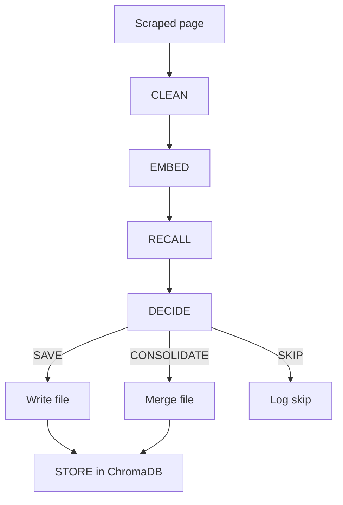

# Agent Pipeline

Each scraped page passes through five steps in `web_scraper/agent.py`:

## 1. CLEAN

The local generation `llama-server` removes boilerplate (nav, footer, sidebar,
ads) through its OpenAI-compatible `/v1/chat/completions` endpoint and returns
body-only plain text. Prompts live in `web_scraper/prompts.py`.

## 2. EMBED

The cleaned text is embedded via the OpenAI-compatible `/v1/embeddings`
endpoint using `nomic-embed-text` (or `OLLAMA_EMBED_MODEL`). Generation and
embedding can use separate `llama-server` hosts through `OLLAMA_HOST` and
`OLLAMA_EMBED_HOST`.

## 3. RECALL

ChromaDB is queried for the top 5 similar documents (cosine distance). Results
above `SIMILARITY_THRESHOLD` (default `0.85`) are passed to the decision step.

## 4. DECIDE

The generation server returns a structured decision:

```text
DECISION: SAVE|CONSOLIDATE|SKIP
TARGET_ID: <doc id for CONSOLIDATE>
REASON: <explanation>
```

| Decision | Action |
|----------|--------|
| `SAVE` | Write a new `NNN_title.txt` file |
| `CONSOLIDATE` | Merge into an existing file and update memory |
| `SKIP` | Do not write; log reason |

## 5. STORE

On save or consolidate, the document embedding and metadata are upserted into
ChromaDB for future recall.

## Failure handling

`SKIP` means the agent intentionally decided not to write a page. A generation,
embedding, ChromaDB, or file-processing exception is counted as `ERROR` instead.
The agent writes the page's original extracted content to the output directory
when possible, then returns control to the crawler so later pages can continue.
The final agent statistics report errors separately from skips.

Embedding inputs over `MAX_EMBED_INPUT_CHARS` (default `6000`) are chunked and
mean-pooled. If `llama-server` rejects a chunk specifically for exceeding its
physical context or batch size, that chunk is split again without discarding
text. Other server errors are surfaced as errors rather than retried as size
failures.

Generated responses must contain non-empty assistant text. Streamed responses
must reach their completion marker, and output ending with a token-limit
`length` reason is treated as incomplete; increase `OLLAMA_NUM_PREDICT` before
retrying.


