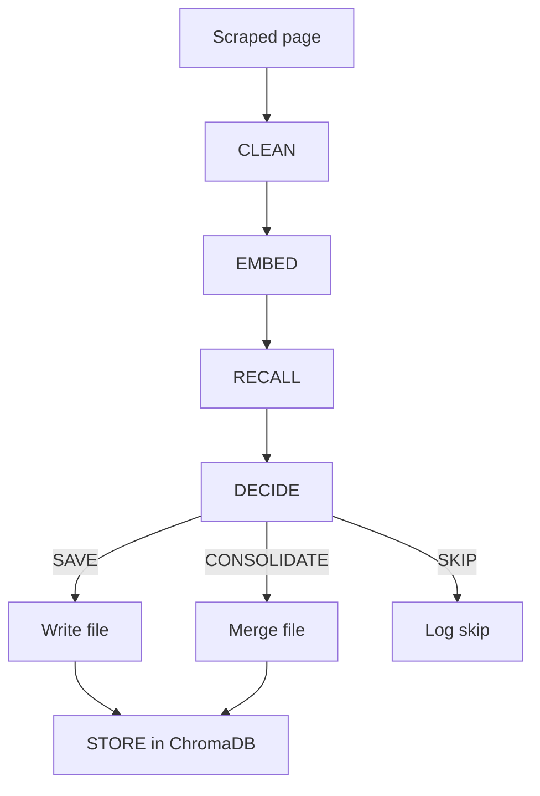

# Agent Pipeline

Each scraped page passes through five steps in `web_scraper/agent.py`:

## 1. CLEAN

Ollama removes boilerplate (nav, footer, sidebar, ads) and returns body-only
plain text. Prompts live in `web_scraper/prompts.py`.

## 2. EMBED

The cleaned text is embedded via Ollama `/api/embed` using `nomic-embed-text`
(or `OLLAMA_EMBED_MODEL`).

## 3. RECALL

ChromaDB is queried for the top 5 similar documents (cosine distance). Results
above `SIMILARITY_THRESHOLD` (default `0.85`) are passed to the decision step.

## 4. DECIDE

Ollama returns a structured decision:

```text
DECISION: SAVE|CONSOLIDATE|SKIP
TARGET_ID: <doc id for CONSOLIDATE>
REASON: <explanation>
```

| Decision | Action |
|----------|--------|
| `SAVE` | Write a new `NNN_title.txt` file |
| `CONSOLIDATE` | Merge into an existing file and update memory |
| `SKIP` | Do not write; log reason |

## 5. STORE

On save or consolidate, the document embedding and metadata are upserted into
ChromaDB for future recall.


