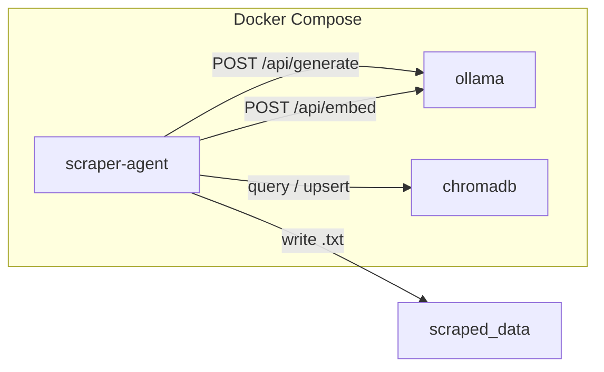

# Architecture Overview

## Services

### scraper-agent

Built from the project `Dockerfile`. Runs `python -m web_scraper` with an
entrypoint that waits for Ollama and ChromaDB health before executing commands.

### ollama

Hosts two models by default:

- **qwen2.5:3b** -- generation (clean, decide, consolidate)
- **nomic-embed-text** -- embeddings for vector similarity (separate model)

### chromadb

Persistent vector store. Each saved or consolidated document is embedded and
stored with URL, title, and timestamp metadata.

## Crawl flow

1. `WebScraper.iter_scraped_pages()` crawls the site (BFS) and yields each page.
2. `ContentAgent.process_document()` runs the agent pipeline per page.
3. Files land in the configured output directory (default `./scraped_data`).

See [Agent Pipeline](./agent-pipeline) and [Memory](./memory) for details.
