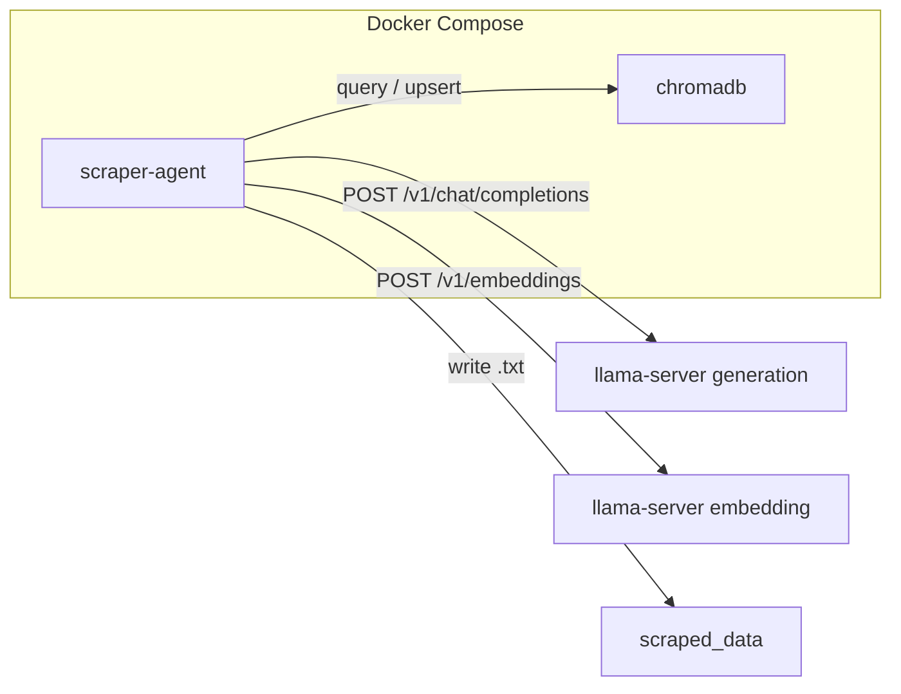

# Architecture Overview

## Services

### scraper-agent

Built from the project `Dockerfile`. Runs `python -m web_scraper` and connects
to ChromaDB plus the configured generation and embedding model servers.

### llama-server processes

The client uses the OpenAI-compatible `llama-server` API. `OLLAMA_HOST` names
the generation server for cleaning and decisions; `OLLAMA_EMBED_HOST` names the
embedding server. The two variables may point to separate processes, commonly
ports `8081` and `8080`. Before crawling, the CLI checks `/v1/models` on each
host and verifies the configured model aliases.

### ollama

The Compose file retains a bundled `ollama` service at port `11434` as a
compatibility path. Its entrypoint pulls the legacy default generation and
embedding models. To use it with the current agent, override both host
variables and use model aliases that the service reports; otherwise use the
two `llama-server` processes described above.

The Python environment variable names keep the `OLLAMA_*` prefix for backward
compatibility; they do not change the `/v1` API used by the current client.

### chromadb

Persistent vector store. Each saved or consolidated document is embedded and
stored with URL, title, and timestamp metadata.

## Crawl flow

1. `WebScraper.iter_scraped_pages()` crawls the site (BFS) and yields each page.
2. `ContentAgent.process_document()` runs the agent pipeline per page.
3. Files land in the configured output directory (default `./scraped_data`).

See [Agent Pipeline](./agent-pipeline) and [Memory](./memory) for details.
